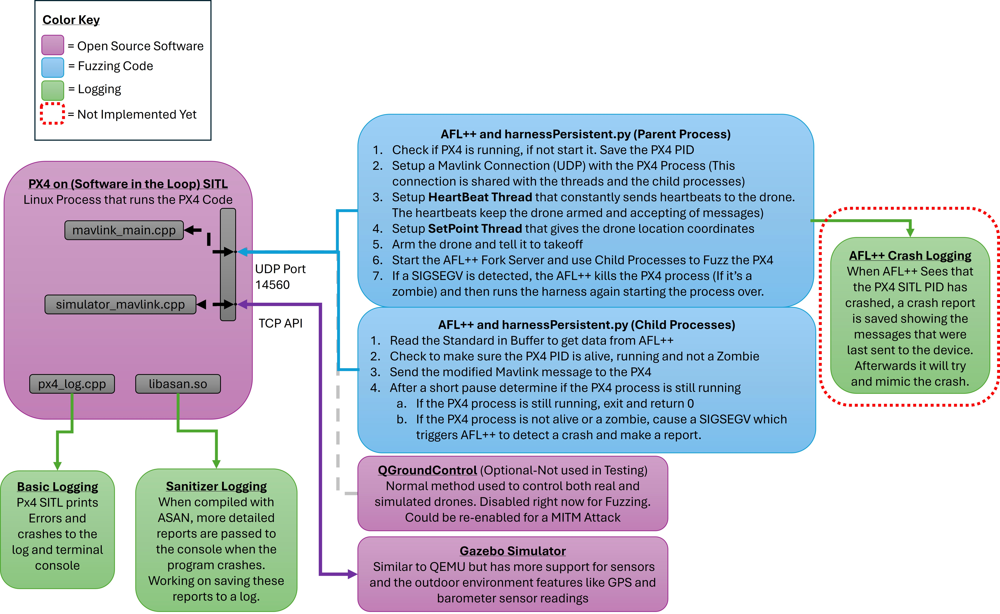

# PX4 Fuzzing Environment Setup (AFL++ Persistent Mode)

This README provides a complete guide for installing all required packages, building PX4 SITL with sanitizers, preparing AFL++ seeds, and running persistent-mode fuzzing against PX4 using a MAVLink harness.

---

## Requirements

Your environment must meet the following requirements before building PX4 and running the fuzzing harness:

### **Operating System (Host or VM)**
- **Ubuntu 24.04 LTS** (recommended and tested)
- Other Linux distros *may* work but are not supported by this guide.

### **System Resources**
- At least **4 CPU cores** (8 recommended for faster AFL fuzzing)
- At least **8 GB RAM** (16+ recommended)
- At least **20 GB free disk space**
  - PX4 + Gazebo + logs + AFL findings can grow quickly.

### **Internet Access**
Required for:
- Installing system packages  
- Downloading PX4, QGroundControl, Gazebo dependencies  
- Fetching Python modules and AFL++ updates  

### **Software Requirements**
This project requires:
- **Python 3.10+**
- **pip** (Python package manager)
- **clang** and **lld** (for ASan builds)
- **AFL++** or **python-afl**
- **Git**
- **PX4-Autopilot** source code
- **Gazebo Garden / Gazebo Classic**
- **QGroundControl (optional)** for manual MAVLink verification

### **Hardware Acceleration (Optional)**
For improved Gazebo performance:
- A GPU that supports **OpenGL 3.3+**
- Proprietary NVIDIA/AMD drivers (optional but helpful)

# Setup Instructions
To setup the fuzzing envrionment either run the setup script below which will run 
the entire setup process or follow the setup steps one at a time. The setup process 
may take up to an hour mor more to complete.  

## Option 1 : Run the setup script
> **Note:** The setup script downloads multiple repositories and dependencies.  
> Depending on your internet connection speed, this process may take **up to an hour or more** to complete.
>
> If the script is **not executed as root**, you will be prompted to enter your **sudo password twice**
> during the installation process.

```bash
./setup_px4_fuzzing.sh
```
## Option 2 : Run the setup steps one at a time 
---

## 1. Install All Required Packages

```bash
sudo apt update && sudo apt-get upgrade -y

sudo apt install -y \
  gstreamer1.0-plugins-bad gstreamer1.0-libav gstreamer1.0-gl \
  libfuse2t64 \
  libxcb-xinerama0 libxkbcommon-x11-0 libxcb-cursor-dev \
  build-essential cmake ninja-build ccache \
  clang lld \
  libc6-dev libstdc++-14-dev \
  libc++-dev libc++abi-dev \
  python3 python3-pip git \
  valgrind afl++ \
  wget unzip tar lcov
```

Install python-afl:

```bash
sudo pip3 install --upgrade python-afl --break-system-packages
```

---

## 2. Clone Required Repositories

Clone this project:

```bash
git clone https://github.com/kfreemanWrightState/PX4Fuzzing.git
cd PX4Fuzzing
```

Clone PX4:
> **Note:** This step downloads multiple repositories and dependencies.  
> Depending on your internet connection speed, this process may take **up to an hour or more** to complete.

```bash
git clone https://github.com/PX4/PX4-Autopilot.git --recursive
```

Clone QGroundControl source (optional):
> **Note:** This is an optional piece of software that can be used to interact with the PX4 Software in the Loop
> It is not needed or used during the fuzzing process.   

```bash
git clone https://github.com/mavlink/qgroundcontrol.git
```

Download the prebuilt QGroundControl AppImage (optional):

```bash
wget https://d176tv9ibo4jno.cloudfront.net/latest/QGroundControl-x86_64.AppImage
chmod +x QGroundControl*
```

---

## 3. Prepare AFL++ Directory and Seeds

Create AFL findings directory:

```bash
mkdir findings
```

Generate seeds (basic MAVLink templates):

```bash
python3 make_seeds.py
```

Allow large sanitizer core dumps:

```bash
ulimit -c unlimited
```

---

## 4. Build PX4 With Sanitizers Enabled

Enter PX4:

```bash
cd PX4-Autopilot/
```

Fix a compile flag error in the PX4 Code
```bash
grep -Rl 'O0-fprofile-arcs' . --exclude-dir=build | xargs sed -i 's/O0-fprofile-arcs/O0 -fprofile-arcs/g'
```

Install PX4-required dependencies:

```bash
./Tools/setup/ubuntu.sh
```

Build PX4 SITL with AddressSanitizer (Does Not Start the simulator yet):

```bash

#PX4_CMAKE_BUILD_TYPE=Coverage \
#CC=clang CXX=clang++ \
#CMAKE_ARGS="\
#-DCMAKE_C_FLAGS='-fsanitize=address' \
#-DCMAKE_CXX_FLAGS='-fsanitize=address' \
#-DCMAKE_EXE_LINKER_FLAGS='-fsanitize=address'" \
#make px4_sitl -j"$(nproc)"

CC=clang CXX=clang++ PX4_ASAN=1 make px4_sitl -j"$(nproc)"
```

This builds:

- PX4 SITL  
- Gazebo simulation plugins  
- ASan/UBSan-instrumented PX4 binaries  

---

## 5. Run AFL++ Persistent Fuzzing


```bash
# If you running the PX4 project on a virtual machine skip this command, however if you are running Ubuntu 
# on a bare metal computer run the following command.  
# This command makes sure all the cores of the processor are set to performace mode. These canse be set back to 
# normal using the ubuntu performace settings
echo performance | sudo tee /sys/devices/system/cpu/cpu*/cpufreq/scaling_governor

```

Run the Python harness with AFL++ :

```bash
cd .. 

AFL_FORKSRV_INIT_TMOUT=60000 AFL_DEBUG=1 AFL_I_DONT_CARE_ABOUT_MISSING_CRASHES=1 \
py-afl-fuzz -t 2000 -i seeds -o findings -- python3 harnessPersistent.py @@
```

AFL++ will:

- start a forkserver  
- reuse the same Python process (persistent mode)  
- inject fuzz inputs into MAVLink messages  
- restart PX4 after crashes  
- log crashes into `findings/`  

---



**Figure: Overview of the PX4 MAVLink Fuzzing Workflow**

This diagram illustrates how AFL++ interacts with the PX4 Software-In-The-Loop (SITL) process during fuzzing.  
The parent harness process maintains the MAVLink connection, sends heartbeats, keeps the drone armed, and runs the AFL++ forkserver.  
Each AFL++ child process receives fuzzed input through standard input, converts it into a MAVLink message, sends it to the PX4 SITL instance, and checks whether PX4 is still alive.

If a crash is detected (or the PX4 PID becomes a zombie), the child triggers a SIGSEGV on itself so AFL++ records the crash and restarts the entire cycle.  
If no crash occurs, the child exits normally and AFL++ continues mutating inputs.


## Notes and Tips

- Gazebo often lingers after crashes. Remove it with:

```bash
pkill -f gz
```

- QGroundControl is optional, but useful for observing PX4 behavior.
- PX4 sanitizer output appears directly in the PX4 terminal window.
- Core dumps (if enabled) are stored in the current directory.

---

## References

### **PX4 Documentation**
- https://docs.px4.io/main/en/
- https://docs.px4.io/main/en/simulation/
- https://docs.px4.io/main/en/sim_gazebo_gz/
- https://docs.px4.io/main/en/getting_started/px4_basic_concepts#ground-control-stations

### **PX4 Fuzz Testing**
- https://docs.px4.io/main/en/test_and_ci/fuzz_tests#running-fuzz-tests

### **AFL++**
- https://aflplus.plus/
- https://github.com/AFLplusplus/AFLplusplus

### **MAVLink Messaging**
- https://www.youtube.com/watch?v=iZ-usX1VXRI
- https://www.youtube.com/watch?v=Ha66uKC-od0
- https://mavlink.io/en/about/overview.html

### **MAVLink Security Research**
- https://arxiv.org/html/2501.18874v2?utm_source=chatgpt.com
- https://cosicdatabase.esat.kuleuven.be/backend/publications/files/conferencepaper/2667?utm_source=chatgpt.com

### **Drone Security Research (DJI / OcuSync / DroneID)**
- https://www.ndss-symposium.org/wp-content/uploads/2023/02/ndss2023_f217_paper.pdf

---
